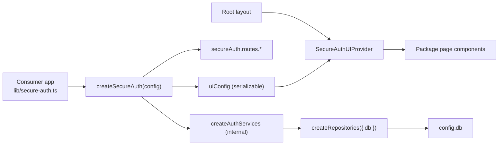

# Architecture

## Package-first model

**`@tgoliveira/secure-auth`** is the product. **`apps/consumer-demo`** is the canonical consumer reference. **`apps/dev-harness`** is the internal development harness (Swagger UI, API docs, extra tooling — not for downstream apps).

Consumers install the package, call `createSecureAuth(config)` once, wire `secureAuth.routes.*`, and optionally mount package UI pages. They do not copy auth modules into their app.

## Monorepo layout

```text
secure-auth/                    # npm workspaces root
├── packages/secure-auth/       # @tgoliveira/secure-auth (reusable package)
├── apps/dev-harness/           # Internal package development harness
├── apps/consumer-demo/         # Canonical consumer reference app
└── docs/                       # Monorepo + package documentation
```

## Design principles

1. **Opinionated, not generic** — Next.js App Router + Drizzle + PostgreSQL only.
2. **One public package** — internal modules are not public API.
3. **App owns infrastructure** — database connection, OAuth secrets, email transport.
4. **Package owns auth domain** — schema, migrations, services, route handlers, default UI.
5. **Configure once** — `createSecureAuth(config)` is the sole composition root.

## Composition root

**`createSecureAuth(config)` from `@tgoliveira/secure-auth/next` is the only supported consumer entry point.**



Consumers must:

- create one `secureAuth` instance;
- register API routes via `secureAuth.routes.*`;
- inject `EmailProvider`, OAuth, WebAuthn, and secrets through `SecureAuthConfig`;
- map environment variables in app code;
- pass `secureAuth.uiConfig` to `SecureAuthUIProvider` in the app layout.

Consumers must **not**:

- import `@tgoliveira/secure-auth/server` (removed);
- call `createRoutes`, `createAuthServices`, or internal helpers;
- deep-import `packages/secure-auth/src/**`.

**Consumer docs:** [consumer-quick-start.md](./consumer-quick-start.md) · [package-api.md](./package-api.md)

## UI configuration

Page defaults (copy, paths, password policy) flow from config — not from global runtime state.

### Server: `createSecureAuth(config).uiConfig`

`uiConfig` is a JSON-serializable `SecureAuthUIPublicConfig` built from `config.ui`, `config.app`, `config.auth`, and `config.passwordPolicy`. It includes `passwordStrength.position` (default `"above"`) for password feedback placement.

```typescript
export const secureAuth = createSecureAuth({
  db,
  app: { name: "My App", slug: "my-app", baseUrl: "..." },
  auth: { afterLoginPath: "/dashboard", /* ... */ },
  ui: {
    paths: { login: "/login", account: "/settings/account", /* ... */ },
    messages: { loginTitle: "Sign in", /* ... */ },
    cssVariables: { "--sa-brand": "#2563eb" },
  },
});

// secureAuth.uiConfig → pass to client provider
```

### Client: `SecureAuthUIProvider`

Wrap the app (typically alongside `SessionProvider`):

```tsx
// app/layout.tsx
import { secureAuth } from "@/lib/secure-auth";
import { SecureAuthUIProvider } from "@tgoliveira/secure-auth/react";

export default function RootLayout({ children }) {
  return (
    <SecureAuthUIProvider config={secureAuth.uiConfig}>
      {children}
    </SecureAuthUIProvider>
  );
}
```

Package pages (`LoginPage`, `RegisterPage`, …) call `useSecureAuthUi()` internally. When wrapped, they inherit paths, messages, `appSlug`, `appName`, and `passwordPolicy` from config. Props on individual pages still override provider defaults.

Reference: `apps/consumer-demo/src/app/layout.tsx`, `apps/consumer-demo/src/components/providers.tsx` (canonical consumer). Internal harness: `apps/dev-harness/src/app/layout.tsx`.

## Dependency injection

There is **no global runtime state**. Services receive `config` and `db` through constructor/factory injection:

```typescript
// Internal (not public API)
createAuthServices(config) → createRepositories({ db }) + createSecureAuthContext({ config })
```

Route handlers receive services via `createRoutes(getServices)` bound to the single `createSecureAuth` call. Config accessors in `core/config-accessors.ts` are pure functions of `SecureAuthConfig` — they do not read `process.env`.

| Belongs in package | Belongs in app |
| --- | --- |
| Auth Drizzle schema + migrations | `DATABASE_URL`, connection pool |
| `createSecureAuth`, services, route handlers | `src/lib/secure-auth.ts` config wiring |
| `EmailProvider` interface + default templates | SMTP/console adapter |
| Default React UI + `SecureAuthUIProvider` | Branding, marketing, product routes |
| Security policies (hashing, rate limit core) | OAuth provider secrets |
| Audit/session/passkey/2FA logic | NextAuth route mount + env |

## Email provider abstraction

```typescript
type EmailProvider = {
  send(input: { to: string; subject: string; html: string; text?: string }): Promise<void>;
};
```

Account emails: `account-auth-service` → `deliverAccountEmail()` → `config.email.provider.send()`.

**No SMTP or console logic in the package.** Apps implement transport in their own `EmailProvider` (see `apps/consumer-demo/src/lib/email-provider.ts`). The dev harness adds SMTP modules in `apps/dev-harness/src/modules/email/core/` for internal testing only.

## Internal modules

| Module | Responsibility |
| --- | --- |
| `core/` | Types, `createAuthServices`, `createSecureAuthContext`, `ui-config` (not public API) |
| `drizzle/` | Auth schema |
| `modules/account` | Users, tokens, deletion policy |
| `modules/auth` | Login, NextAuth options, OAuth policy |
| `modules/sessions` | Account sessions |
| `modules/two-factor` | TOTP, backup codes |
| `modules/passkeys` | WebAuthn |
| `modules/audit` | Audit events |
| `modules/rate-limit` | Rate limiting adapters |
| `modules/email` | `deliverAccountEmail` + default templates |
| `modules/security` | Hashing, IP, logging, password policy |
| `modules/ui` | UI primitives, pages, `SecureAuthUIProvider` |
| `next/` | **`createSecureAuth`** (public) |
| `server/routes/` | Route handler registry (via `secureAuth.routes.*` only) |

## Module boundaries

Internal modules under `packages/secure-auth/src/modules/` follow strict dependency rules:

```text
route handlers
    ↓
auth, account, sessions, two-factor, passkeys
    ↓
email, audit, rate-limit, security
    ↓
(infrastructure: Drizzle, Auth.js — server only)

ui  ←  (no imports from domain modules)
```

### Forbidden dependencies

1. `ui` must not import account/auth server logic or database clients.
2. `security`, `email`, `audit`, `rate-limit` must not import UI or app routes.
3. No module may import product-specific vault or letter code.
4. Client components must not import database clients, repositories, or server secrets.

### Server/client separation

| Layer | May import |
| --- | --- |
| Client components | Client-safe APIs, `ui` primitives |
| Server components / route handlers | Full module APIs via public exports |
| Package `ui` pages | Client hooks, `@tgoliveira/secure-auth/client` |

Route files in consumer apps stay **thin**: parse request → delegate to `secureAuth.routes.*` → return response.

## Consumer reference vs dev harness

**`apps/consumer-demo`** demonstrates the recommended integration pattern for downstream apps:

| Concern | Location |
| --- | --- |
| Composition root | `src/lib/secure-auth.ts` |
| UI provider wiring | `src/app/layout.tsx` + `src/components/providers.tsx` |
| Email transport | `src/lib/email-provider.ts` |
| API routes | Thin wrappers around `secureAuth.routes.*` |
| Auth pages | Thin wrappers around package page components |

See [apps/consumer-demo/README.md](../apps/consumer-demo/README.md).

**`apps/dev-harness`** is the internal package development harness (Swagger UI, OpenAPI, extra routes). See [apps/dev-harness/README.md](../apps/dev-harness/README.md). Do not copy from it when integrating the package.
