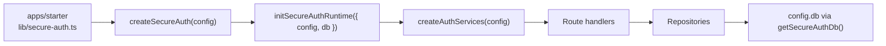

# Architecture

## Monorepo layout

```text
secure-auth/                    # npm workspaces root
├── packages/secure-auth/       # @tgoliveira/secure-auth (single reusable package)
├── apps/starter/             # Integration harness / reference consumer
└── docs/                     # Monorepo + package documentation
```

## Design principles

1. **Opinionated, not generic** — Next.js App Router + Drizzle + PostgreSQL only.
2. **One public package** — internal modules are not public API.
3. **App owns infrastructure** — database connection, OAuth secrets, email transport.
4. **Package owns auth domain** — schema, migrations, services, route handlers, default UI.
5. **Configure once** — `createSecureAuth(config)` is the single factory.

## Package boundaries

| Belongs in package | Belongs in app |
| --- | --- |
| Auth Drizzle schema + migrations | `DATABASE_URL`, connection pool |
| `createSecureAuth`, services, route handlers | `src/lib/secure-auth.ts` config wiring |
| `EmailProvider` interface + default templates | SMTP/console adapter (`apps/starter/src/modules/email/`) |
| Default React UI primitives | Branding pages, marketing, product routes |
| Security policies (hashing, rate limit core) | OAuth provider secrets |
| Audit/session/passkey/2FA logic | NextAuth route mount + env |

## Dependency injection



### What was found (hardening phase)

| Pattern | Status |
| --- | --- |
| `initDbContext` + `initAuthConfig` (dual globals) | **Removed** — merged into `secure-auth-runtime.ts` |
| `getDb()` / `getSecureAuthConfig()` | **Retained** — thin accessors to runtime bound by `createSecureAuth` |
| `db` Proxy in `@/lib/db` | **Retained** — delegates to `config.db`; requires `createSecureAuth` first |
| Singleton service objects (`accountService`, …) | **Retained 0.1.x** — module singletons; constructed with runtime deps |
| Service locator for optional deps | **None** |

### Target (0.2.x)

```typescript
const secureAuth = createSecureAuth({
  db,
  email: { provider, from },
  // optional logger in future minor
});
```

Repositories will accept `db` via constructor/factory instead of the runtime proxy.

### What intentionally remains

- **Single runtime store** — one `SecureAuthRuntime` per process, set by `createSecureAuth(config)`. This is explicit initialization, not ambient `process.env` reads in services.
- **Module-level services** — route handlers import services directly; `getServices()` is available for handlers that need the full registry.

## Email provider abstraction

The package defines:

```typescript
type EmailProvider = {
  send(input: { to: string; subject: string; html: string; text?: string }): Promise<void>;
};
```

Account emails flow: `account-auth-service` → `deliverAccountEmail()` → `config.email.provider.send()`.

**No SMTP, SendGrid, Resend, or console logic in the package.** The starter implements transport in `apps/starter/src/modules/email/core/` and wires it in `src/lib/secure-auth.ts`.

## Internal modules

| Module | Responsibility |
| --- | --- |
| `core/` | Types, `createAuthServices`, `secure-auth-runtime` |
| `drizzle/` | Auth schema |
| `modules/account` | Users, tokens, deletion policy, account lifecycle |
| `modules/auth` | Login, NextAuth options, OAuth policy |
| `modules/sessions` | Account sessions |
| `modules/two-factor` | TOTP, backup codes |
| `modules/passkeys` | WebAuthn |
| `modules/audit` | Audit events |
| `modules/rate-limit` | Rate limiting adapters |
| `modules/email` | `deliverAccountEmail` + default templates only |
| `modules/security` | Hashing, IP, logging, password policy |
| `modules/ui` | Default UI primitives |
| `next/` | `createSecureAuth` |
| `server/routes/` | Next.js route handler factories |

## Starter as integration harness

See [starter-module-dedup-candidates.md](./starter-module-dedup-candidates.md).
