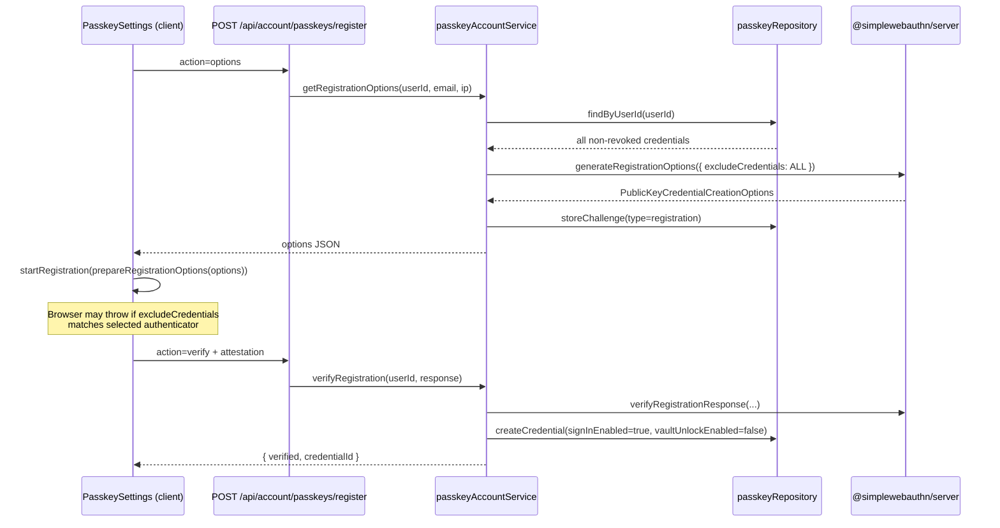

# Passkey registration capability boundary audit

**Date:** 2026-06-11  
**Scope:** `@tgoliveira/secure-auth` account passkey registration vs vault-only credentials  
**Status:** Fixed in `@tgoliveira/secure-auth` (Unreleased) — see [Implementation](#implementation-status) below.

---

## Implementation status

**Fixed:** `getRegistrationOptions` now builds `excludeCredentials` via `toSignInExcludeCredentials()`, including only credentials with `signInEnabled === true`. Vault-only credentials are omitted. Account registration still creates new rows with `signInEnabled: true` and `vaultUnlockEnabled: false` without modifying existing vault-only credentials.

**Remaining platform caveat:** Some authenticators may still prevent multiple credentials for the same user/RP on one device even when vault-only IDs are omitted from `excludeCredentials`. A future explicit capability-upgrade flow may be required to enable account sign-in on an existing vault-only passkey.

---

## 1. Executive summary (original investigation)

**Issue confirmed:** Account passkey registration previously built WebAuthn `excludeCredentials` from **every** non-revoked credential for the user, without filtering on `signInEnabled` or `vaultUnlockEnabled`.

Vault-only credentials (`signInEnabled: false`, `vaultUnlockEnabled: true`) are therefore included in `excludeCredentials`. When the user tries to register an account login passkey on the **same physical authenticator** already used for vault unlock, the browser/authenticator typically rejects registration with:

```txt
The authenticator was previously registered
```

This is a **package-level bug** relative to the intended capability model documented in `docs/consumer-passkey-capability-boundaries.md`. Login already filters to `signInEnabled === true`; registration does not, creating an inconsistent boundary.

**Recommended fix (future implementation):** Filter `excludeCredentials` to credentials that already occupy account sign-in capability — at minimum `signInEnabled === true`. Do not silently upgrade vault-only rows during account registration.

**Caveat:** Fixing `excludeCredentials` alone does not enable “same authenticator, two separate capability rows” on all platforms. WebAuthn generally allows one discoverable credential per authenticator per RP. Enabling sign-in on an authenticator that already holds a vault-only credential for the same RP likely requires a dedicated **capability-upgrade flow** (proof of possession + explicit user confirmation), not a second registration.

---

## 2. Current account passkey registration flow



### Entry points

| Layer | File | Role |
| --- | --- | --- |
| Route handler | `packages/secure-auth/src/server/routes/handlers/account/passkeys-register.ts` | Delegates to `passkeyAccountService` for `options` / `verify` |
| Service | `packages/secure-auth/src/modules/passkeys/services/passkey-account-service.ts` | Builds options, verifies attestation, inserts credential |
| Repository | `packages/secure-auth/src/modules/passkeys/repositories/passkey-repository.ts` | `findByUserId`, `createCredential`, challenge storage |
| Client UI | `packages/secure-auth/src/modules/ui/features/settings/passkey-settings.tsx` | Calls API, `startRegistration`, no option mutation |
| Client helper | `packages/secure-auth/src/modules/passkeys/lib/prepare-webauthn-options.ts` | Passthrough — returns options unchanged |
| API client | `packages/secure-auth/src/lib/api-client/passkey-account.ts` | `registerOptions` / `registerVerify` |

---

## 3. Current vault-only passkey registration flow

The package **does not** implement vault unlock passkey registration. Vault-only credentials are expected to be created by downstream consumer apps that share the `passkey_credentials` table.

Consumer guidance (`docs/consumer-passkey-capability-boundaries.md`):

- Vault credentials: `signInEnabled: false`, `vaultUnlockEnabled: true`
- Account registration (package): always inserts `signInEnabled: true`, `vaultUnlockEnabled: false`

There is no package API for vault passkey setup, capability upgrade, or merging flags on an existing row.

---

## 4. How `excludeCredentials` is built today

In `getRegistrationOptions`:

```typescript
const existing = await repos.passkeyRepository.findByUserId(userId);
const options = await generateRegistrationOptions({
  // ...
  excludeCredentials: existing.map((c) => ({
    id: c.credentialId,
    transports: (c.transports as AuthenticatorTransport[]) ?? undefined,
  })),
});
```

`findByUserId` returns **all** non-revoked credentials for the user:

```typescript
.where(and(eq(passkeyCredentials.userId, userId), isNull(passkeyCredentials.revokedAt)))
```

No capability filter is applied before mapping to `excludeCredentials`.

---

## 5. Whether `signInEnabled` is considered

| Flow | Considers `signInEnabled`? |
| --- | --- |
| Passkey **login** (`allowCredentials`) | **Yes** — `creds.filter((c) => c.signInEnabled)` |
| Account passkey **list** / **delete** | **Yes** — capability-aware via `passkey-capabilities.ts` |
| Account passkey **registration** (`excludeCredentials`) | **No** — all credentials included |

Registration is the outlier.

---

## 6. Whether `vaultUnlockEnabled` is considered

**No.** `vaultUnlockEnabled` is not read during `getRegistrationOptions` or `verifyRegistration`.

It is only used for list/delete UI and API boundaries (0.1.24+).

---

## 7. Whether vault-only credentials can block account passkey registration

**Yes**, when the user selects the same authenticator that owns the vault-only credential.

Mechanism:

1. Vault-only row exists with `credentialId` = `X`.
2. Account registration options include `{ id: X }` in `excludeCredentials`.
3. User initiates account passkey registration and picks that authenticator.
4. Client/WebAuthn platform rejects with *“The authenticator was previously registered”* (or equivalent).

Vault-only credentials do **not** block registration on a **different** authenticator today — only the excluded credential IDs matter, and each authenticator has its own credential ID. The reported bug matches same-authenticator retry, not cross-device registration.

---

## 8. Package bug vs consumer integration issue

| Aspect | Owner |
| --- | --- |
| `excludeCredentials` includes vault-only IDs | **Package bug** |
| Vault credential creation with correct flags | Consumer responsibility (documented) |
| Vault removal / envelope lifecycle | Consumer responsibility |
| Same-authenticator dual-capability (sign-in + vault on one key) | **Not supported** by registration today; needs explicit upgrade flow (future design) |

Downstream apps that correctly set `signInEnabled: false` on vault credentials are not at fault for this error. The package contradicts its own capability model by treating vault-only rows as registration exclusions.

---

## 9. Recommended fix

### Primary fix (package)

In `getRegistrationOptions`, build `excludeCredentials` only from credentials that already hold account sign-in capability:

```typescript
const existing = await repos.passkeyRepository.findByUserId(userId);
const signInCredentials = existing.filter((c) => c.signInEnabled);

excludeCredentials: signInCredentials.map((c) => ({
  id: c.credentialId,
  transports: (c.transports as AuthenticatorTransport[]) ?? undefined,
})),
```

Optional: extract a shared helper (e.g. `credentialsForSignInExcludeList`) alongside login’s `resolveLoginCredentialAllowList` pattern for consistency.

### Out of scope for this fix (explicit follow-up)

1. **Capability upgrade flow** — User confirms enabling sign-in on an existing vault-only credential (update flags + audit), with proof of possession. Required when the user wants the **same** authenticator for both capabilities.
2. **`verifyRegistration` duplicate guard** — Today, if registration somehow returns an existing `credentialId`, `createCredential` hits the unique constraint on `credential_id` with an unhandled DB error. A clear 409 with a capability-specific message would improve UX after the exclude list fix.
3. **Dual-capability registration policy** — Document whether a new account registration on an authenticator that already has vault-only should be rejected server-side even when exclude list is fixed (platform-dependent).

### Do not do

- Silently set `signInEnabled: true` on an existing vault-only row during account registration verify.
- Silently merge `vaultUnlockEnabled` into a new account registration row when a vault row exists for the same `credentialId`.

---

## 10. Code locations likely to change

| File | Change |
| --- | --- |
| `packages/secure-auth/src/modules/passkeys/services/passkey-account-service.ts` | Filter `excludeCredentials` by `signInEnabled` |
| `packages/secure-auth/src/modules/passkeys/lib/passkey-capabilities.ts` | Optional shared helper for “sign-in credential IDs” |
| `packages/secure-auth/src/modules/passkeys/services/__tests__/passkey-account-service.test.ts` | New tests for registration options filtering |
| `docs/consumer-passkey-capability-boundaries.md` | Document registration exclude behavior after fix |
| `docs/package-api.md` | Note account registration exclude policy |
| `CHANGELOG.md` | Bug fix entry on implementation |

**Not expected to change:** route handlers, client UI, `prepareRegistrationOptions` (passthrough), vault flows in consumer apps.

---

## 11. Tests required before implementation

1. **`getRegistrationOptions` excludes only sign-in credentials**
   - Mock `findByUserId` with mix: sign-in-only, vault-only, dual-capability, revoked.
   - Assert `generateRegistrationOptions` receives `excludeCredentials` containing only IDs where `signInEnabled === true` and not revoked.
   - Requires mocking `@simplewebauthn/server` `generateRegistrationOptions` or inspecting call args.

2. **Vault-only credential omitted from exclude list**
   - Single vault-only row → `excludeCredentials` is `[]` (or undefined/empty per library defaults).

3. **Dual-capability credential still excluded**
   - `signInEnabled: true`, `vaultUnlockEnabled: true` → credential ID **is** in exclude list (already registered for sign-in).

4. **Revoked credentials never excluded**
   - `findByUserId` already filters revoked; regression test optional.

5. **Integration / route test (optional)**
   - Extend `account-passkeys-routes.test.ts` if options handler is tested with real service wiring.

6. **Documentation test checklist**
   - Manual repro script (section 13) becomes automated where feasible (Playwright + test DB).

**Gap today:** `passkey-account-service.test.ts` covers list/delete boundaries only; **no** registration options tests exist.

---

## 12. Risks and backwards compatibility

| Risk | Mitigation |
| --- | --- |
| Users relied on vault-only exclusion blocking duplicate registration | That behavior was unintended; fixing aligns with capability docs |
| Same authenticator for vault + sign-in after fix | User may still fail at platform level or get duplicate `credentialId` on verify — document upgrade flow |
| Security: omitting vault-only from exclude list | Does not grant sign-in; verify still creates separate row with `signInEnabled: true`; login still filters sign-in creds |
| Multiple sign-in passkeys | Unchanged — all `signInEnabled: true` IDs remain excluded |
| Consumer apps with wrong flags (`signInEnabled: true` on vault creds) | Would still exclude — consumer must set flags correctly (existing guidance) |

Backwards compatibility: **behavior change** for users with vault-only credentials registering account passkeys on the same device. Semver: patch or minor bug fix (recommend patch in changelog as bug fix).

---

## 13. Manual reproduction steps

**Prerequisites**

- Consumer app or test harness sharing `passkey_credentials` with `@tgoliveira/secure-auth`
- User with one vault-only passkey: `sign_in_enabled = false`, `vault_unlock_enabled = true`
- Account settings with passkey registration enabled

**Steps**

1. Register vault passkey via consumer vault flow (not account settings).
2. Confirm DB row: `sign_in_enabled = false`, `vault_unlock_enabled = true`, note `credential_id`.
3. Open account security → Add passkey (account sign-in).
4. Capture `POST /api/account/passkeys/register` with `action: "options"`.
5. Inspect response `excludeCredentials` — **today** includes vault `credential_id`.
6. Complete WebAuthn with the **same** authenticator used for vault.
7. Observe browser error: *“The authenticator was previously registered”*.

**Expected after fix**

- Step 5: vault `credential_id` **absent** from `excludeCredentials`.
- Step 6 (same authenticator): may still fail on some platforms (one credential per RP per authenticator) — that indicates need for capability-upgrade flow, not exclude list.
- Step 6 (different authenticator): registration should proceed.

---

## 14. Final recommendation

| Question | Answer |
| --- | --- |
| Is the issue confirmed? | **Yes** |
| Are vault-only credentials in `excludeCredentials` today? | **Yes** — all user credentials are included |
| Does fix belong in `@tgoliveira/secure-auth`? | **Yes** |
| Exact behavior to change | Filter `excludeCredentials` to `signInEnabled === true` only in `getRegistrationOptions` |
| Tests to add later | Registration options filtering tests (see section 11) |
| Same-authenticator vault → sign-in | Separate capability-upgrade feature; not solved by exclude list alone |

**Implementation priority:** High — blocks a documented consumer pattern (vault first, account sign-in later on same device).

**Do not implement silently merging capabilities** during account registration verify.

---

## Appendix: Answers to investigation questions

1. **Which credentials are in `excludeCredentials`?** All non-revoked credentials for the user, regardless of capability flags.

2. **All credentials or only `signInEnabled === true`?** All credentials today.

3. **Can vault-only credentials block account registration?** Yes, on the same authenticator, via `excludeCredentials`.

4. **Separate capabilities treated separately?** Partially — list/delete/login yes; registration no.

5. **Multiple credentials same user/RP with different capabilities?** DB supports multiple rows; registration exclusion currently prevents same-authenticator second registration even when capabilities differ; different authenticators work.

6. **Cause of “authenticator was previously registered”?** Primarily **package-generated `excludeCredentials`** including vault-only credential IDs; enforced by **browser/authenticator** WebAuthn behavior. Not caused by client `prepareRegistrationOptions` or downstream option mutation (none found).

7. **Package or consumer issue?** **Package.**

8. **Exact code to change:** `passkey-account-service.ts` → `getRegistrationOptions` → filter before `excludeCredentials` map.

9. **Tests required:** See section 11.
